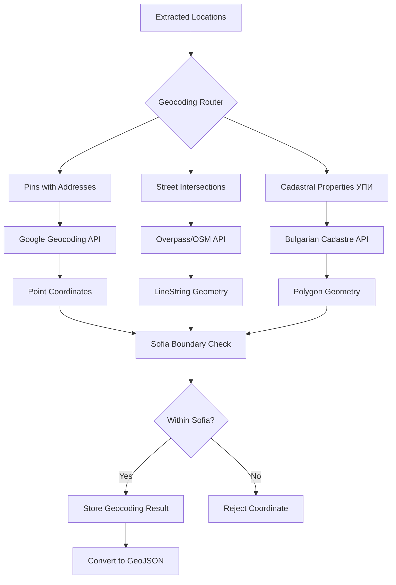

# Geocoding System Overview

## Overview

The geocoding system converts location descriptions from infrastructure announcements into map coordinates using three specialized services. Each service handles a specific type of location data: Google API for specific addresses, OpenStreetMap/Overpass for street intersections, and Bulgarian Cadastre for property identifiers (УПИ).

These geocoding services are publicly acknowledged on the [sources page](/sources) in the "Geocoding" section.

**Core Behavior**: A message stating "ул. Иван Вазов 15, между бул. Витоша и ул. Граф Игнатиев, УПИ 68134.1601.6124" triggers all three geocoding services to map the pin location, street section, and property boundary.

## Architecture

The geocoding router dispatches location types to appropriate services based on the extracted data structure:

## Service Selection Logic

The router determines which geocoding service to use based on location type:

| Location Type            | Service                           | Example                                                       | Output              |
| ------------------------ | --------------------------------- | ------------------------------------------------------------- | ------------------- |
| Specific Address (pin)   | [Google](geocoding-google.md)     | "ул. Раковски 35"                                             | Point coordinate    |
| Street Section           | [Overpass](geocoding-overpass.md) | "ул. Граф Игнатиев между бул. Витоша и бул. Патриарх Евтимий" | LineString geometry |
| Cadastral Property (УПИ) | [Cadastre](geocoding-cadastre.md) | "УПИ с идентификатор 68134.1601.6124"                         | Polygon boundary    |

**Multiple Services**: A single message commonly triggers all three services when it describes a construction site (УПИ), affected streets, and a contact address.

## Rate Limiting Strategy

Each service applies rate limiting to respect API terms and manage costs:

| Service                           | Delay  | Constant                   | Reason                                                 |
| --------------------------------- | ------ | -------------------------- | ------------------------------------------------------ |
| [Google](geocoding-google.md)     | 200ms  | `GEOCODING_BATCH_DELAY_MS` | API pricing and quota management                       |
| [Overpass](geocoding-overpass.md) | 500ms  | `OVERPASS_DELAY_MS`        | Fair use policy for free OSM APIs                      |
| [Cadastre](geocoding-cadastre.md) | 2000ms | `DELAY_BETWEEN_REQUESTS`   | Session management overhead and government API respect |

## Sofia Boundary Validation

All geocoding services validate coordinates fall within Sofia city boundaries using `isWithinSofia()` boundary check:

- **Coordinates outside Sofia**: Rejected and logged as errors
- **Purpose**: Prevents displaying infrastructure disruptions from other Bulgarian cities
- **Boundary Definition**: Defined in `SOFIA_BOUNDS` constant (administrative boundaries)

## Related Documentation

- [Message Filtering](message-filtering.md) - AI-powered relevance filtering and extraction
- [Message Ingest Pipeline](../../ingest/messageIngest/README.md) - Complete processing pipeline
- [Data Extraction Prompt](../../ingest/prompts/data-extraction-overpass.md) - AI extraction rules for locations
